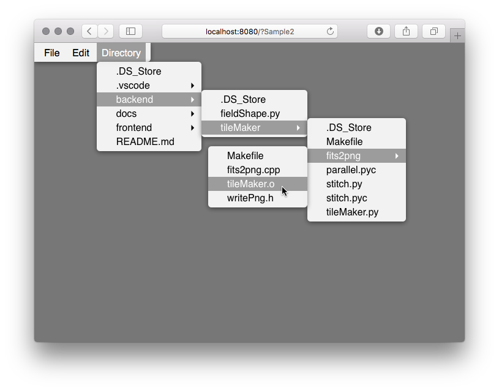

# vue-menu
# Introduction
## [Working Demo](https://michitaro.github.io/vue-menu)
## Features
* Menu component for vue2
* Deeply nested menu supported
* Props "checked" & "disabled"
* Keybinds
* Y-scrollable if necessary
* Contextmenu
* Builtin 2 themes (black & white)
* Customizable color
* Menuitem can contain any HTML not only text
* Tested on Safari10, Chrom60, Firefox55, IE11, Edge38 for PCs
* Does not work on mobile devices 😞



# Usage
## Install
```sh
npm install --save @hscmap/vue-menu
```

## Setup

### ES6 / TypeScript
```typescript
import Vue from 'vue'
import * as hscmapMenu from '@hscmap/vue-menu'

Vue.use(hscmapMenu)
```

### CommonJS
```javascript
var Vue = require('vue')
Vue.use(require('@hscmap/vue-menu'))
```

# Example
```html
<template>
    <hsc-menu-style-white>
        <hsc-menubar style="border-radius: 0 0 4pt 0;">
            <hsc-menubaritem label="File">
                <hsc-menuitem label="New" @click="window.alert('New')" />
                <hsc-menuitem label="Open" @click="window.alert('Open')" />
                <hsc-menu-separator/>
                <hsc-menuitem label="Save" @click="window.alert('Save')" :disabled="true" />
                <hsc-menuitem label="Export to">
                    <hsc-menuitem label="PDF" />
                    <hsc-menuitem label="HTML" />
                </hsc-menuitem>
            </hsc-menubaritem>
            <hsc-menubaritem label="Edit">
                <hsc-menuitem label="Undo" keybind="meta+z" @click="window.alert('Undo')" />
                <hsc-menu-separator/>
                <hsc-menuitem label="Cut" keybind="meta+x" @click="window.alert('Cut')" />
                <hsc-menuitem label="Copy" keybind="meta+c" @click="window.alert('Copy')" />
                <hsc-menuitem label="Paste" keybind="meta+v" @click="window.alert('Paste')" :disabled="true" />
            </hsc-menubaritem>
        </hsc-menubar>
    </hsc-menu-style-white>
</template>
```
Other examples are available [here](http://michitaro.github.io/vue-menu/).
